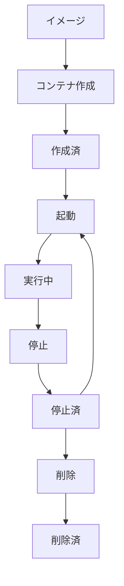

# コンテナのライフサイクルについて学ぶ
イメージからコンテナを作成する



使用例）
```shell
docker container create --name web nginx:latest
```

## コンテナ操作のコマンド
コンテナを作成
```shell
docker container create --name コンテナ名　イメージ名
```

コンテナを起動
```shell
docker container start コンテナ名
```

コンテナを停止
```shell
docker container stop コンテナ名
```

コンテナを削除
```shell
docker container rm コンテナ名
```

コンテナを作成して起動
```shell
docker container run --name コンテナ名 イメージ名
```

## コンテナ一覧を確認

```shell
# コンテナを表示
docker container ls
# 全て表示
docker container ls --all
# 状態の確認
docker ps
```

停止してないコンテナを強制的に削除
```shell
docker container rm web --force
```

バックグラウンドで実行
```shell
docker container run --name web --detach nginx:latest
```

## コンテナ名の競合について

同じ名前のコンテナを作成しようとすると以下のようなエラーが発生します：

```shell
docker: Error response from daemon: Conflict. The container name "/web" is already in use by container "c8275dd76f10b566721c85e36d995275647951d96b0580c814412bc473e5aac8". You have to remove (or rename) that container to be able to reuse that name.
```

### 解決方法

1. 既存のコンテナを削除する
```shell
docker container rm web
# または強制削除
docker container rm web --force
```

2. 別の名前を使用する
```shell
docker container run --name web2 --detach nginx:latest
```

3. 自動生成された名前を使う（--nameを省略）
```shell
docker container run --detach nginx:latest
```