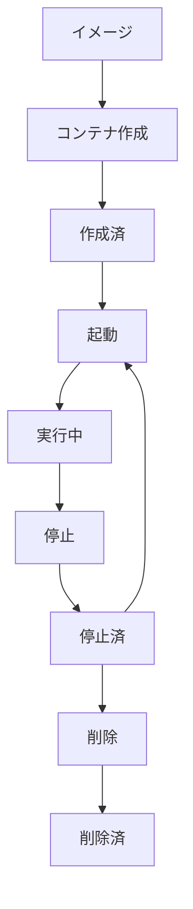

# コンテナのライフサイクルについて学ぶ
イメージからコンテナを作成する


```mermaid
graph TD
    Image[イメージ] --> Create[コンテナ作成]
    Create --> Created[作成済]
    Created --> Start[起動]
    Start --> Running[実行中]
    Running --> Stop[停止]
    Stop --> Stopped[停止済]
    Stopped --> Start
    Stopped --> Remove[削除]
    Remove --> Removed[削除済]
```
 
```shell
docker container create --name web nginx:latest
```